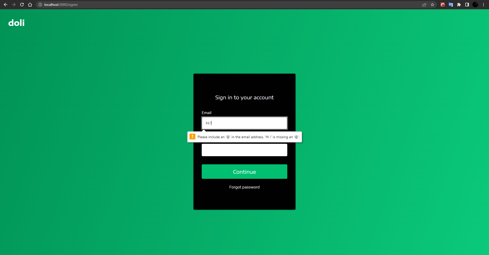

# Responsive Website doli
<!-- ABOUT THE PROJECT -->
## About The Project

I developed a modern fully responsive website using all of my gained knowledge about react.js. In this website, I used react-router-dom for the sign-in page, react-scroll for smooth and easy-to-access pages, styled-components for excellent components, and responsive design.

### Project Images





### Built With

* [React.js](https://reactjs.org/)
* [Node.js](https://nodejs.org/en/)
* [React Router](https://reactrouter.com/)
* [React-Scroll](https://www.npmjs.com/package/react-scroll)
* [styled-components](https://styled-components.com/)

<p align="right">(<a href="#top">back to top</a>)</p>

<!-- GETTING STARTED -->
## Getting Started

To get a local copy up and running follow these simple steps.

### Prerequisites

You need to install prerequisites before running the project. Please write the following code snips on your terminal.
* npm

  ```sh
  npm install npm@latest -g
  ```

### Installation

1. Clone the repo

   ```sh
   git clone https://github.com/dyakupoglu/React_doli_Website.git
   ```
2. Install NPM packages

   ```sh
   npm install
   ```

<p align="right">(<a href="#top">back to top</a>)</p>

## License

Licensed under the [MIT License](https://github.com/dyakupoglu/React_doli_Website/blob/main/LICENSE)

<p align="right">(<a href="#top">back to top</a>)</p>